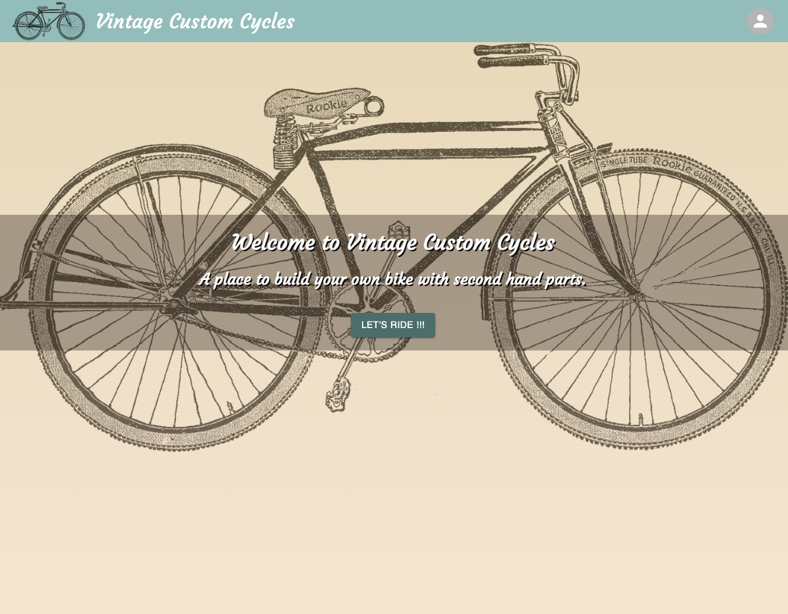
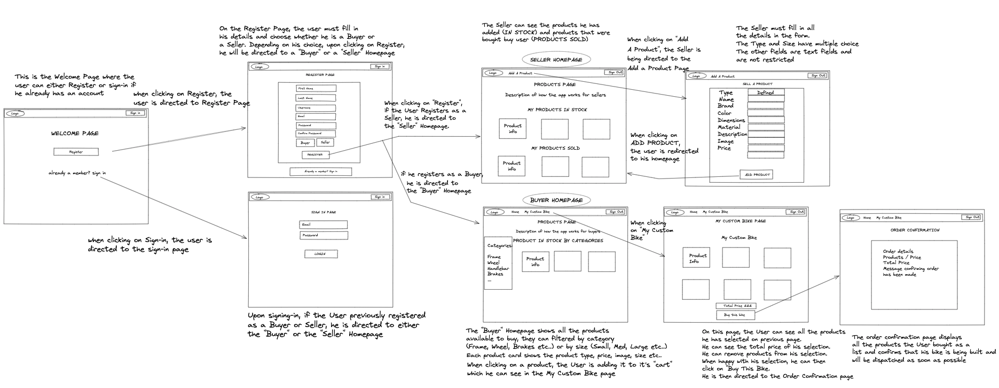
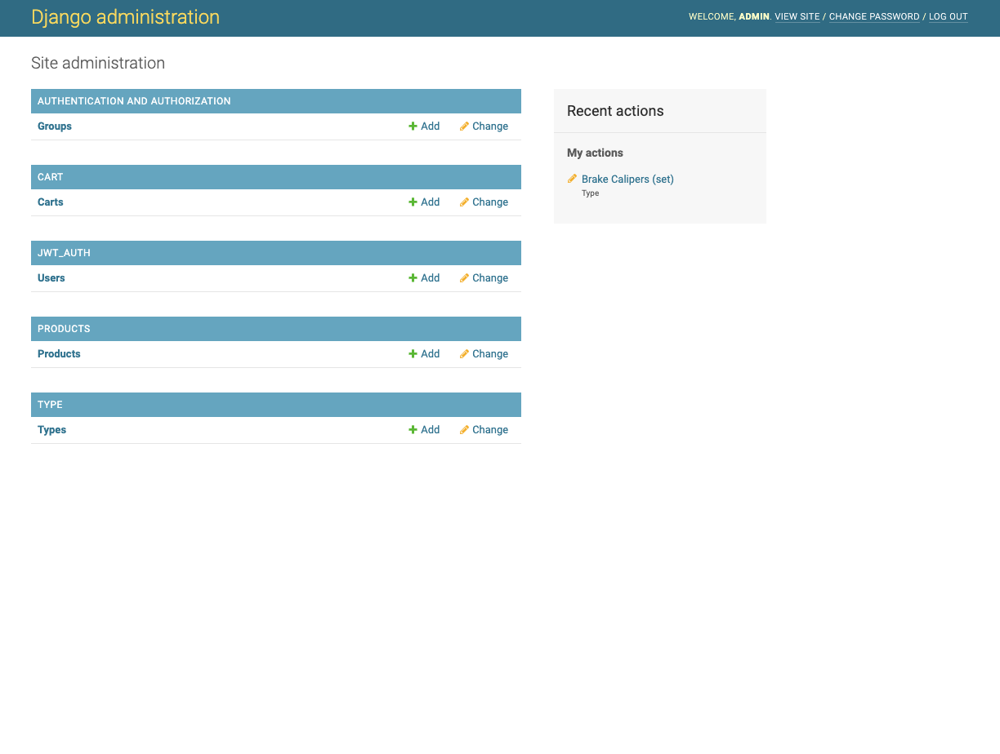
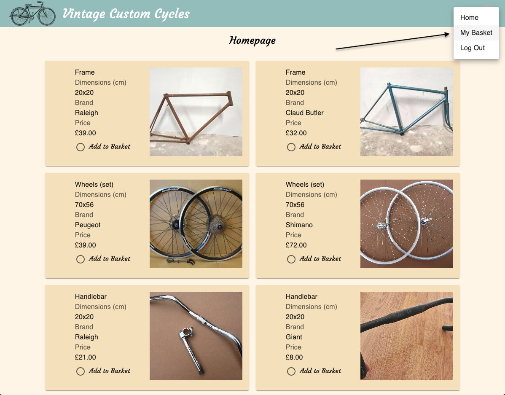
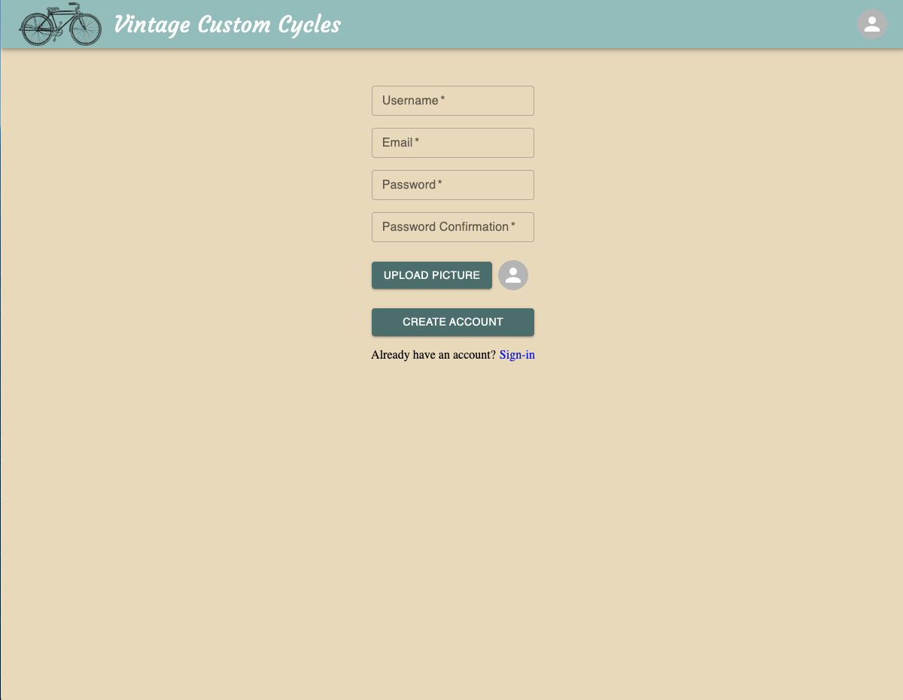
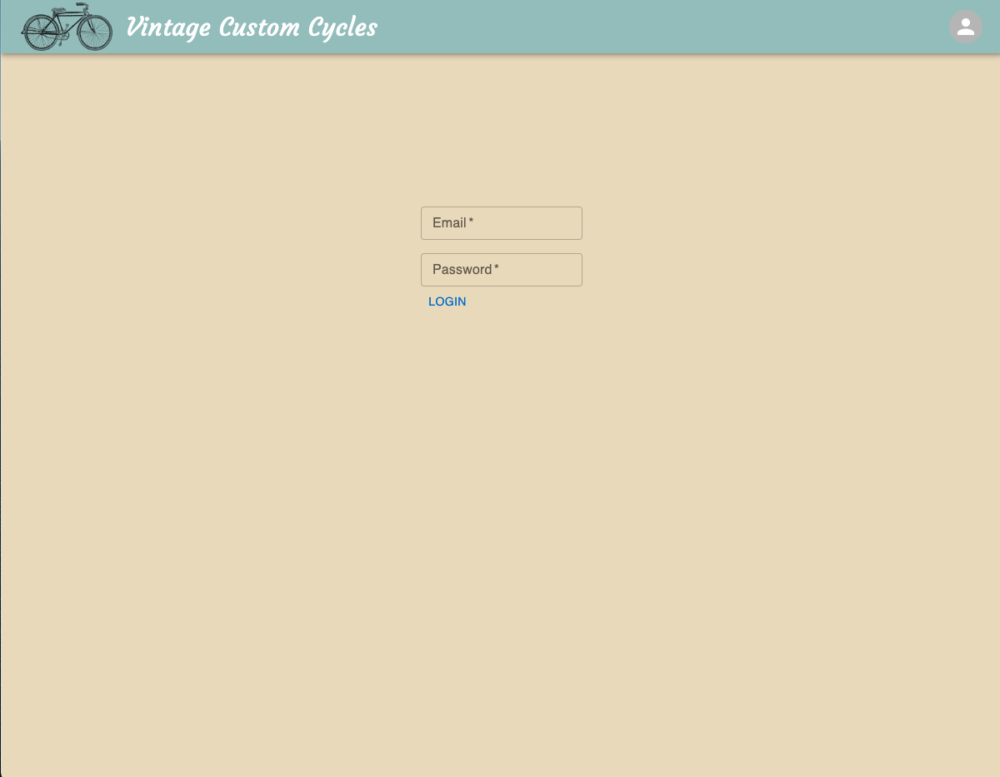

# VINTAGE CUSTOM CYLES


## Project Description
**Vintage Custom Cycles** is a marketplace to buy and sell second-hand bike products with the purpose of building your own bike. Users (or buyers) can select their chosen products and virtually build a bike from spare parts.
The back-end was developed with **Python** in **Django** whilst React was used to build the front-end. The data is stored on a PostgreSQL database. 

## Deployment Link
 [https://vintage-custom-cycles.netlify.app/](https://vintage-custom-cycles.netlify.app// "Vintage Custom Cycles")

### API Repository Link
 [ https://github.com/thomalex001/ga-project-4-api]( https://github.com/thomalex001/ga-project-4-api/ "Vintage Custom Cycles API Repository Link")


## Getting Started/Code Installation
Ensure that you have cloned or downloaded both front-end and back-end repositories onto your machine and follow these steps:
1. In the back-end CLI, run the command `python manage.py runserver`.
3. In the front-end CLI, run `npm i` on the root level to install dependencies.
4. Then run the command `npm start` to run program in your local environment.


### Dependencies
* Django CORS Headers
* Django Rest Framework
* Django Auth
* MUI (React components library)
* SASS
* Axios 
* Seed.js


## Timeframe 
This was my last project at General Assembly after recently learning Python and Django. I dedicated a full day of planning using a detailed wireframe, please see below:


## Technologies Used
* Excalidraw (wireframe)
* HTML/SASS/JavaScript
* Django/Python
* React
* Visual Studio Code
* Postman
* Git/GitHub
* Axios packages
* CORS packages
* MUI (React components library)
* Google Fonts
* Netlify (deployment front-end)
* Heroku (deployment back-end)


## Brief/Technical Requirements

- **Build a full-stack application** by making my own backend with Django and front-end with React
- **Use Python with Django for the API** using a Django framework to serve my data from a PostgreSQL database
- **Consume an API with a separate front-end** built with React
- **Be a complete product** which most likely means multiple relationships and CRUD functionality for at least a couple of models
- **Be deployed online** publicly accessible.

## Planning


* Used Excalidraw to build a wireframe and design the basic layout of the app.
  * The wireframe shows 8 pages, 3 of which are accessible wihout having to login: Welcome, Register, Login as seen above.

  * The original project idea included two **"Register Options"**. The User could either register as a **Seller** or as a **Buyer**. This would make the app dynamic and simulate a real life e-commerce webstite, however, given the timeframe, the first version of the app only includes the **"Buyer's views"**.
  * A navigation bar is used to navigate between each main pages.

## Build/Code Process

### Developing The API - Day One 

* Excalidraw
  * Created a wireframe with each pages/components and general flow of the app. This was a crucial part of my project as after completing the wireframe, I was able to write down each of the API requirements.

* Installation
  * Created a new repository on GitHub. 
  * Initial setup of the backend API application by installing the dependencies.
  * Ran the command `python3 manage.py runserver` 
  * Created a superuser with the command `python3 manage.py createsuperuser`


* Created the apps `Products`, `Types` and `Cart`, and added them to `INSTALLED_APPS` as below:

```python
INSTALLED_APPS = [
    'django.contrib.admin',
    'django.contrib.auth',
    'django.contrib.contenttypes',
    'django.contrib.sessions',
    'django.contrib.messages',
    'django.contrib.staticfiles',
    'rest_framework',
    'jwt_auth',
    'products',
    'type',
    'cart',
    'corsheaders',
]
```

### Developing the API - Day Two 

* Created **models** for `Products`, `Types` and `Cart` tested the relationships within each using Django back-end on the browser (see below).



Example of `Products` model :

```python
from django.db import models

# Create your models here.
from django.db import models

class Product(models.Model):  
    type = models.ForeignKey(
        'type.Type', related_name="products",  blank=True, on_delete=models.CASCADE)
    dimensions = models.CharField(max_length=50)
    brand = models.CharField(max_length=50)
    color = models.CharField(max_length=50)
    material = models.CharField(max_length=50)
    description = models.CharField(max_length=200)
    image = models.CharField(max_length=300)
    price = models.DecimalField(max_digits=6, decimal_places=2)
    owner = models.ForeignKey(
        'jwt_auth.User',
        related_name="products",
        on_delete=models.CASCADE
    )
    def __str__(self):
        return f"{self.brand} - {self.color}"
 ```


* Created `serializers` and `views` for each apps `Products`, `Types` and `Cart`.
* created `jwt_auth` app which allows the front-end to create users, manage authentifications etc... 

### Developing The React app - Day One

* Installation
  * Created a new repository on GitHub. 
  * Initial setup of the frontend application by installing the dependencies:
    * Axios 
    * CORS 
    * SASS
    * MUI
  * Created a `.gitignore` file and added `“node module”; “.env”; “DS_store”`.
  * Added the boiler plate code below in `api.js` to connect the front-end to the back-end 

```javascript
import axios from 'axios';
import { AUTH } from './auth';

const getHeaders = () => ({
  headers: { Authorization: `Bearer ${AUTH.getToken()}` }
});

const ENDPOINTS = {
  register: `${process.env.REACT_APP_BASE_URL}/api/auth/register/`,
  login: `${process.env.REACT_APP_BASE_URL}/api/auth/login/`,
  allProducts: `${process.env.REACT_APP_BASE_URL}/api/products/`,
  createUserCart: `${process.env.REACT_APP_BASE_URL}/api/cart/`,
  cloudinary: `https://api.cloudinary.com/v1_1/${process.env.REACT_APP_CLOUDINARY_CLOUD_NAME}/image/upload`,
  // search: (query) => `/api/books/search?q=${query}`,
  // updateUserCart: (cartId) => `/api/cart/${cartId}/`,
  userCart: (cartId) => `${process.env.REACT_APP_BASE_URL}/api/cart/${cartId}/`
};

const GET = (endpoint, headers) =>
  headers ? axios.get(endpoint, headers) : axios.get(endpoint);
const POST = (endpoint, body, headers) =>
  headers ? axios.post(endpoint, body, headers) : axios.post(endpoint, body);
const PUT = (endpoint, body, headers) => axios.put(endpoint, body, headers);
const DELETE = (endpoint, headers) => axios.delete(endpoint, headers);

export const API = { GET, POST, PUT, DELETE, ENDPOINTS, getHeaders };
```

### Developing The React app - Day Two

* Created the `NavBar` which allows the user to navigate between **Home** and **My Basket** and allows user to either **LogIn** or **LogOut** (see top right of image). 



* Created `Welcome`, `Register` and `Login` pages.





### Developing The React app - Day Three

* Created `BuyersHomepage`, `Cart` and `OrderConfirmation` pages. 
* Added styling to all pages using SASS.
* Added Logo and various images to the app.


## Challenges
* Planning the relationships between each app in Django was challenging at first.
* Keeping with the original design based on the wireframe.

## Wins
* The process of linking the back-end to the front-end felt very smooth as I had pas experience using Node and React. 
* Having total freedom in the back-end and front-end designs made this project
really fun and enjoyable.

## Key Learning/Takeways
* Django apps models and relationships
* Building of a full-stack app for the first time using Django/React as a solo project

## Bugs
* Some of the images in the `BookCard` are not showing with the right format which can be due to some CSS rules. 

## Future Improvements
* Making the whole app responsive to mobile and tablet.
* Adding total price and removing each item bought from the database
* Adding a **"Sellers"** login in order to make the app dynamic.
* Adding the Avatars uppon login.

## THANKS FOR READING!

